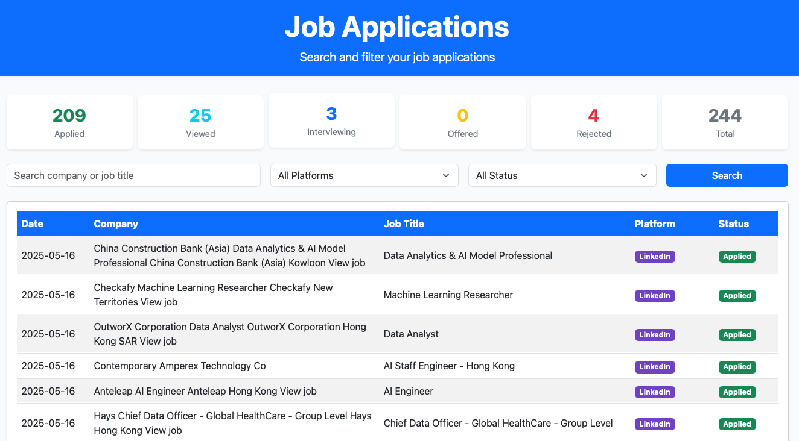

# Job Application Email Processor & Dashboard

A powerful, automated solution for tracking and managing your job applications. This system automatically extracts job application information from your email inbox, stores it in a secure AWS RDS database, and presents it through an intuitive web dashboard. Perfect for job seekers who want to maintain a clear overview of their application status and history.

Key Benefits:
- **Automation**: No manual data entry needed - automatically extracts job details from your emails
- **Organization**: Keep track of all your applications in one place
- **Insights**: Monitor your application status and response rates
- **Scalability**: Cloud-based solution that grows with your needs
- **Security**: Your data is securely stored in AWS RDS



## Features
- **Automated Email Processing:**
  - Extracts job application info from LinkedIn and JobsDB emails.
  - Handles batch/digest emails from JobsDB (multiple applications in one email).
  - Skips duplicates based on company, job title, and date.
- **Database Storage:**
  - Stores all applications in AWS RDS MySQL database.
  - Auto-increments the `number` field for each new entry.
  - Secure and scalable cloud database solution.
- **Web Dashboard:**
  - View all applications in a beautiful, responsive Bootstrap table.
  - Search and filter by company, job title, platform, and status.
  - See application date, company, job title, platform, and status at a glance.
- **AWS Integration:**
  - Secure connection to AWS RDS MySQL instance.
  - Automated data pipeline for reliable data storage.
  - Cloud-based solution for better scalability and reliability.

## Dashboard Preview
Here's a demonstration of the dashboard's interactive features:


## Data Pipeline Structure
```
┌─────────────────┐     ┌─────────────────┐     ┌─────────────────┐
│                 │     │                 │     │                 │
│  Email Inbox    │────▶│  Email Parser   │────▶│  Data Processor │
│                 │     │                 │     │                 │
└─────────────────┘     └─────────────────┘     └────────┬────────┘
                                                         │
                                                         ▼
┌─────────────────┐     ┌─────────────────┐     ┌─────────────────┐
│                 │     │                 │     │                 │
│  Web Dashboard  │◀────│  Flask Server   │◀────│  AWS RDS MySQL  │
│                 │     │                 │     │                 │
└─────────────────┘     └─────────────────┘     └─────────────────┘
```

### Pipeline Components:
1. **Email Inbox**
   - Source of job application emails
   - Connects via Gmail API
   - Filters for LinkedIn and JobsDB emails

2. **Email Parser**
   - Extracts job details from emails
   - Handles different email formats
   - Identifies duplicates

3. **Data Processor**
   - Cleans and normalizes data
   - Formats data for database storage
   - Handles batch processing

4. **AWS RDS MySQL**
   - Stores processed job applications
   - Maintains data integrity
   - Enables efficient querying

5. **Flask Server**
   - Serves the web dashboard
   - Handles API requests
   - Manages data retrieval

6. **Web Dashboard**
   - Displays job applications
   - Provides search and filter functionality
   - Real-time data updates

## Folder Structure
```
email_processor/
  process_job_emails.py      # Main script to process emails and update DB
  templates/
    index.html               # Web dashboard template (for Flask app)
  README.md                  # This file
jobapp_web/
  app.py                     # Flask web app (alternative location)
  templates/
    index.html               # Web dashboard template
.env                          # Environment variables (not included)
```

## Setup Instructions

### 1. Clone the repository and install dependencies
```
pip install -r requirements.txt
```

### 2. Configure environment variables
Create a `.env` file in the project directory with:
```
EMAIL_ADDRESS=your_gmail_address@gmail.com
EMAIL_PASSWORD=your_gmail_app_password # e.g xxxx xxxx xxxx xxxx
DB_HOST=your_aws_rds_endpoint
DB_USER=your_aws_rds_username
DB_PASSWORD=your_aws_rds_password
DB_NAME=your_database_name
TARGET_DATE=02-May-2025  # For email processing script
AWS_REGION=your_aws_region  # e.g., us-east-1
```

### 3. AWS RDS Setup
1. Create an AWS RDS MySQL instance if you haven't already
2. Configure security groups to allow access from your application
3. Note down the RDS endpoint, username, and password
4. Update your `.env` file with the RDS credentials

### 4. Run the email processor
```
python process_job_emails.py
```
This will extract job applications from your Gmail and update the MySQL database.

### 5. Run the web dashboard
Navigate to the `jobapp_web` or `email_processor` directory (wherever your Flask app is):
```
python app.py
```
Then open [http://localhost:5000](http://localhost:5000) in your browser.

### 6. Automated Email Processing Setup
To automatically process emails at regular intervals, set up a cron job:

1. **Open your crontab file:**
```bash
crontab -e
```

2. **Add a cron job to run the script every hour:**
```bash
0 * * * * cd /path/to/your/project && /usr/bin/python3 process_job_emails.py >> /path/to/your/project/cron.log 2>&1
```

Or to run it every 30 minutes:
```bash
*/30 * * * * cd /path/to/your/project && /usr/bin/python3 process_job_emails.py >> /path/to/your/project/cron.log 2>&1
```

3. **Verify the cron job is set:**
```bash
crontab -l
```

4. **Check the logs:**
```bash
tail -f /path/to/your/project/cron.log
```

Note: Make sure to:
- Replace `/path/to/your/project` with your actual project path
- Ensure the Python script has execute permissions
- Test the cron job manually first
- Monitor the logs for any errors

## Customization
- **Change the target date:** Edit `TARGET_DATE` in your `.env` file.
- **Change database/table:** Update your `.env` and SQL queries as needed.
- **UI tweaks:** Edit `templates/index.html` for custom styles or columns.
- **AWS Configuration:** Modify AWS region and RDS settings in `.env` file.
- **Cron Schedule:** Adjust the cron job timing to match your needs

## Requirements
- Python 3.7+
- Flask
- PyMySQL
- python-dotenv
- AWS RDS MySQL instance
- AWS CLI (optional, for additional AWS services)

## Security Note
- Use an [App Password](https://support.google.com/accounts/answer/185833) for Gmail, not your main password.
- Never commit your `.env` file with real credentials to a public repository.
- Ensure your AWS RDS security groups are properly configured.
- Use IAM roles and policies for secure AWS access.

## License
This project is licensed under the MIT License - see the [LICENSE](LICENSE) file for details.

---

**Enjoy your automated job application tracker and dashboard!**